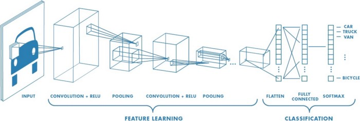
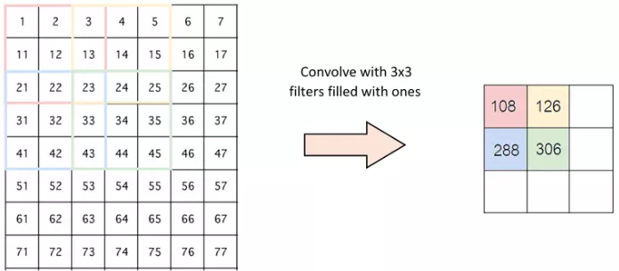

# Buổi 4 & 5: Thực hành huấn luyện mô hình phân biệt có phải là Pizza

## Giới thiệu về Mạng nơ-ron tích chập (CNN)

**CNN (Convolutional Neural Network - Mạng nơ-ron tích chập)** là một loại mạng nơ-ron được thiết kế đặc biệt để xử lý dữ liệu có cấu trúc lưới như hình ảnh. CNN rất hiệu quả trong các tác vụ nhận dạng hình ảnh, phát hiện đối tượng và xử lý thị giác máy tính.

### Thành phần chính của mạng CNN

### 1. Lớp tích chập (Convolutional Layer)

Lớp tích chập đầu tiên dùng để trích xuất đặc trưng từ hình ảnh đầu vào bằng cách sử dụng các bộ Kernel nhỏ trượt qua hình ảnh để tạo ra các bản đồ đặc trưng

- Hai thông số trong việc trượt qua các hình ảnh ấy:

  - Stride: Là bước nhảy của Kernel
    
  - Padding: Khi Kernal không phù hợp sẽ chèn thêm 0 vào viền của các ảnh

### 2. Lớp gộp (Pooling Layer)

- Lớp pooling sẽ giảm bớt số lượng tham số khi hình ảnh quá lớn. Không gian pooling còn được gọi là lấy mẫu con hoặc lấy mẫu xuống làm giảm kích thước của mỗi map nhưng vẫn giữ lại thông tin quan trọng.

- Các pooling có thể có nhiều loại khác nhau:

  - Max Pooling
  - Average Pooling
  - Sum Pooling

### 3. **Lớp làm phẳng (Flatten Layer)**

Chuyển đổi dữ liệu từ ma trận nhiều chiều thành vector một chiều
Kết nối dữ liệu từ các lớp tích chập đến lớp kết nối đầy đủ

### 4. **Lớp kết nối đầy đủ (Fully Connected Layer)**

Giống như mạng nơ-ron thông thường
Thực hiện phân loại dựa trên đặc trưng đã trích xuất

Thường là các lớp cuối cùng của mạng

[nguồn tham khảo](https://viblo.asia/p/deep-learning-tim-hieu-ve-mang-tich-chap-cnn-maGK73bOKj2)

## Sử dụng Google Colab để huấn luyện mô hình

- Code để train [PizzaClassifier_train.ipynp](PizzaClassifier_train.ipynp)

- Code để predict sau khi có model [PizzaClassifier_predict.ipynp](PizzaClassifier_predict.ipynp)

- Link [Google Drive](https://drive.google.com/drive/folders/1_aneixuLeznS8IwarXdUo1-HA_CQvrDs?usp=sharing)
